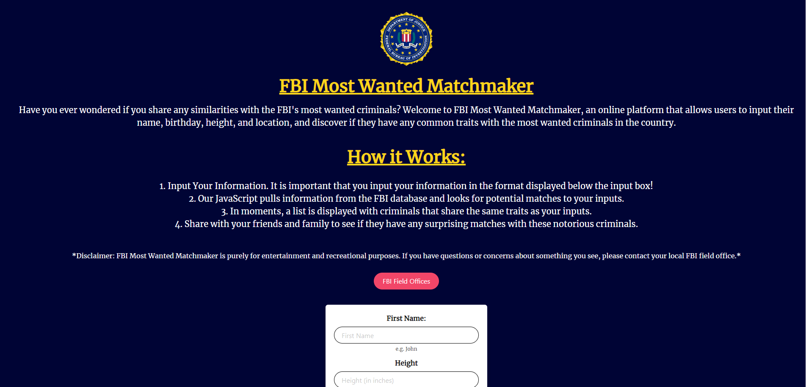

# FBI Most Wanted Matchmaker

## Description
This project was completed so users could see people on the FBI's Most Wanted list that are either near the user, have the same name, or have the same height as the user. 

## Installation
N/A

## Usage
Users can input their first name, their height in inches, and can check a checkbox that allows the application to track the user's location. These variables are saved to local storage, and the user is redirected to a separate page. The new page displays people on the FBI's Most Wanted list that are either in the same city as the user, have the same first name as the user, or have the same height as the user.

## Credits
Nick Almond (Github: https://github.com/almondnick)
Deontae Hicks (Github: https://github.com/Dhicks-dev)
Peyton Weber (Github: https://github.com/peytonweber419)
Katy Thompson (Github: https://github.com/katycaroline)
FBI API: https://api.fbi.gov/docs
Geolocator API: https://www.abstractapi.com/api/ip-geolocation-api
Thank you Brett and Chris for your guidance on this project!

## License
N/A

## Deployment

Link to deployed application: https://almondnick.github.io/fbi-criminal-finder/